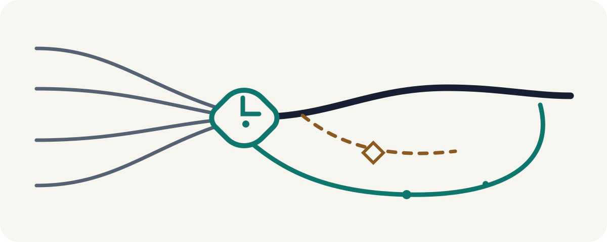

<div align="center">

[简体中文](README.zh-CN.md)

<picture>
  <source media="(prefers-color-scheme: dark)" srcset="assets/hero-dark.svg">
  <source media="(prefers-color-scheme: light)" srcset="assets/hero-light.svg">
  
</picture>

# Think It Through · 想清楚

**Do not let AI flawlessly execute the wrong task.**

An open Agent Skill for independent builders, solo operators, and small teams making consequential choices with limited resources. Use it before starting a project, choosing a direction, committing more resources, or automatically continuing after results arrive. It helps clarify the real decision, identify the answer most likely to change it, and choose a next step that can be tested and reassessed.

[Quick Start](#quick-start) · [When to use it](#when-to-use-it) · [How it works](#how-it-works)

</div>

> [!IMPORTANT]
> **v0.2.0 is the repository-designated stable source snapshot, but there is currently no public Git tag, GitHub Release, or downloadable `.skill` asset.** This source branch contains the unreleased v0.3.0 candidate. The Quick Start below pins the v0.2.0 source commit instead of relying on a moving branch. The reliable entry point is explicit `/think-it-through` invocation in Claude Code.

## Quick Start

### 1. Install the stable source snapshot for Claude Code

You need Git and an existing Claude Code installation. The non-overwrite check stops if another copy is already installed.

```bash
git clone https://github.com/zemu2718/think-it-through-skill.git
cd think-it-through-skill
git checkout 3b9320b8890d36e592e86e89bf98e5103d4cf7d1
test ! -e ~/.claude/skills/think-it-through
mkdir -p ~/.claude/skills
cp -R skills/think-it-through ~/.claude/skills/
```

If the top-level Skill directory did not exist when your current Claude Code session started, restart Claude Code.

### 2. Invoke it explicitly

```text
/think-it-through
```

Then paste one important choice, for example:

```text
I built a scheduling SaaS for small shops, but no unfamiliar customer has paid yet.
Before I spend three more months building and write a launch campaign,
help me decide what to validate first.
```

**First success signal:** instead of immediately writing the campaign, the Skill should first help clarify the decision you are actually making.

This is a source snapshot, not a GitHub Release. Copying files proves only that files were copied; it does not certify loading or behavior in a particular runtime/version. If the destination already exists, do not merge two versions—inspect it, then rename or remove the old copy yourself before reinstalling.

## A 30-second walkthrough

> **Illustrative walkthrough — synthetic, not a runtime transcript.** It explains the product shape; it is not a user testimonial, compatibility result, or claim about a real model run.

**Surface task**

Keep developing the scheduling product for three months and write a launch campaign.

**Real decision**

Should you keep investing now, or first test whether an unfamiliar shop owner will pay for the current version?

**One answer that could change the decision**

What real payment or refusal outcome would make you revise the decision to keep investing?

**Real-world evidence loop**

Show the current version and invite real payment without adding features. Record payment, explicit refusal, and the reasons given. Bring those results back to decide whether to continue, adjust, pause, or stop.

This synthetic example deliberately invents no sample size, deadline, price, or successful outcome. It is not a real runtime transcript.

## When to use it

**A simple rule:** invoke `/think-it-through` before an important commitment—or after real results arrive, before you automatically continue.

| Decision moment | Bring this kind of issue |
| --- | --- |
| **Before starting** | Is this project or product worth doing, and what should be validated before full development? |
| **Before choosing a path** | Which option better serves the real objective, and what unknown could change the ranking? |
| **Before committing resources** | Should we begin development, hire, buy, launch, promote, partner, or make a harder-to-reverse promise? |
| **Before doubling down** | Does the evidence justify more time, budget, scope, or reputation risk? |
| **After results arrive** | Given what actually happened, should we continue, adjust, pause, or stop? |

You do not need to prepare a framework or polished brief. Paste the choice, what you are about to do, and any constraint you already know. If you only have a vague sense that something is off, say that—the Skill will start by clarifying the decision.

This is a decision tool, not a project-management or task-execution layer. It should stay out of the way for factual lookup, a clear low-risk task after the decision is made, pure creation, or technical review and research with no unresolved choice. In emergencies, take immediate protective action first; do not use it to replace licensed medical, legal, investment, or other professional judgment.

## How it works


1. **Share what you are considering.** A problem, choice, plan, or sense that something is off is enough.
2. **Clarify what actually matters.** The Skill separates the requested task from the result you want to achieve or protect.
3. **Answer one deciding question.** It asks for the single answer most likely to change the direction, ranking, or commitment.
4. **Receive a judgment and a real-world check.** You get a conditional direction, one primary evidence loop, and a copyable decision snapshot.
5. **Bring results back to reassess.** New evidence can change the judgment instead of being forced to fit it.

Evidence or independent participation is a conditional side branch—a Gate—not a mandatory stage. It is proposed only when it could change the judgment, and it requires the relevant authorization before use.

## Safe by default

Without a separate, specific authorization, the Skill defaults to:

- **no network access**;
- **no private-data access**;
- **one current main agent**;
- **no file or remote persistence**;
- **no external action** such as sending, publishing, purchasing, deleting, or contacting someone.

A capability is used only when the current session actually provides it, it has clear decision value, and the corresponding authorization is granted. A refusal, failure, or unexecuted action must not be presented as completed. See the normative [behavior and safety contract](REQUIREMENTS.md) **[Chinese]** and the [Security Policy](SECURITY.md).

## Compatibility and evidence status

“Open format,” “installer can copy files,” “runtime loads the Skill,” “the model follows it,” and “native features work” are different claims.

| Claim | Current public status |
| --- | --- |
| Agent Skills format and repository contracts | Static validators, schemas, fixtures, and harnesses are present in this source candidate. |
| Installer target mappings | Eight mappings are defined; a target mapping is not a verified runtime. |
| Runtime loading and text behavior | The public matrix currently records every L0–L5 level as `not_run`. |
| Native controls, search, extra agents, private data, persistence, or external actions | Session-dependent and not implied by format or installation. |

The machine-readable source of truth is [`compatibility/runtime-support.json`](compatibility/runtime-support.json). Static CI, schemas, fixtures, and wireframes cannot prove a real model run or native host experience.

Automatic discovery is not the reliable entry point: the frozen v0.1 holdout scored **9/16 overall—1/8 positives triggered, while 8/8 negatives stayed out**. See the exact [trigger evidence and limitations](benchmarks/trigger-v0.1/README.md). Historical [v0.1 behavior evidence](benchmarks/behavior-v0.1/README.md) covers only three fixed scenarios with one run per configuration; it does not establish v0.2.0 or v0.3.0 behavior.

## FAQ

### Is there a downloadable release?

Not yet. There is currently no public Git tag, GitHub Release, or downloadable `.skill` asset. The Quick Start installs the repository-designated v0.2.0 source snapshot at a fixed commit.

### Why pin a commit after cloning?

A normal clone checks out the current default branch, which can move. Pinning `3b9320b8890d36e592e86e89bf98e5103d4cf7d1` makes the version you install explicit and reviewable.

### How can I inspect the v0.3.0 candidate?

Review the `feat/v0.3.0-agent-skills` branch and its diff. It remains a moving, unreleased source candidate; do not treat it as a stable download or public compatibility claim.

### Why does it not start automatically?

The frozen discovery evidence did not meet its positive-recall target. Explicit `/think-it-through` invocation is currently more reliable than expecting natural-language auto-discovery.

### Will it automatically search, read files, or call several agents?

No. Those capabilities are off by default and independent from one another. Need, current-session availability, and the relevant authorization must all be established before use.

### How do I install it for one project, update it, or build a local candidate?

For a project-scoped install, copy `skills/think-it-through` into that project's `.claude/skills/` directory with the same non-overwrite protection. To update or uninstall, first inspect the exact installed directory and avoid merging versions. Maintainer validation and local candidate build steps are in [CONTRIBUTING.md](CONTRIBUTING.md).

## Documentation map

| You want to… | Read… |
| --- | --- |
| Understand the product, audience, and non-goals | [`PRODUCT.md`](PRODUCT.md) **[Chinese; this README provides the English product summary]** |
| Review the normative behavior, safety, and acceptance contract | [`REQUIREMENTS.md`](REQUIREMENTS.md) **[Chinese]** |
| Inspect the runtime source | [`skills/think-it-through/SKILL.md`](skills/think-it-through/SKILL.md) **[primarily Chinese]** |
| Verify the exact `.skill` file set | [`distribution/package-manifest.json`](distribution/package-manifest.json) |
| Check runtime evidence status | [`compatibility/runtime-support.json`](compatibility/runtime-support.json) |
| Understand the non-normative architecture rationale | [`docs/product-architecture-v0.3.0.md`](docs/product-architecture-v0.3.0.md) **[Chinese]** |
| Contribute a case or fix | [`CONTRIBUTING.md`](CONTRIBUTING.md) |
| Report a vulnerability privately | [`SECURITY.md`](SECURITY.md) |
| Review source-version history | [`CHANGELOG.md`](CHANGELOG.md) **[Chinese]** |

## Contributing

The most useful contributions are concrete and testable:

- a real decision case that exposes a failure;
- a positive or close-negative trigger example;
- a reproducible installation or compatibility observation;
- an accessibility, privacy, safety, or provenance correction.

Start with [CONTRIBUTING.md](CONTRIBUTING.md). Report security issues privately through [SECURITY.md](SECURITY.md).

If you have tried Think It Through and found it useful, a Star makes the project easier to find again. Concrete issues and decision cases are equally valuable.

## License

Think It Through is released under the [MIT License](LICENSE). Adapted method sources, fixed revisions, licenses, and material changes are recorded in [`THIRD_PARTY_NOTICES.md`](THIRD_PARTY_NOTICES.md) and the [third-party audit](docs/third-party-audit.md).
