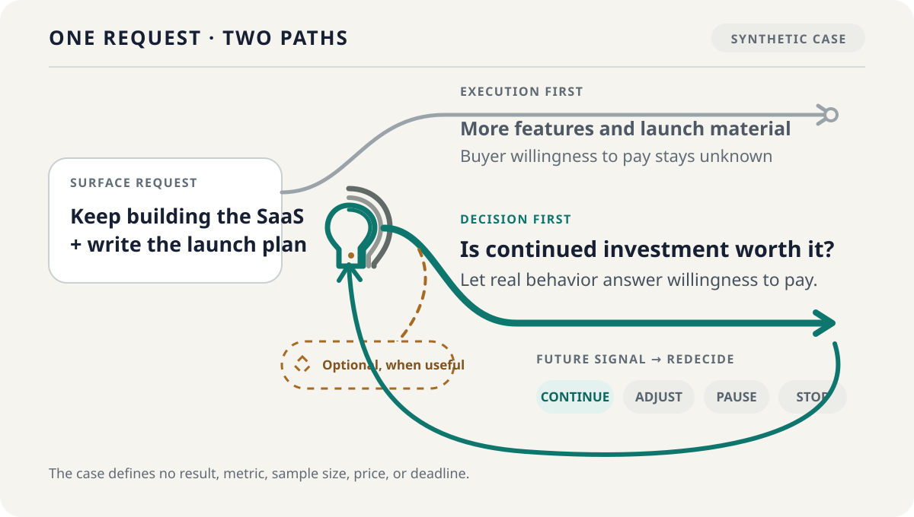

<div align="center">

[简体中文](README.zh-CN.md)

<picture>
  <source media="(prefers-color-scheme: dark)" srcset="assets/readme-banner-dark.png">
  <source media="(prefers-color-scheme: light)" srcset="assets/readme-banner-light.png">
  
</picture>

# Think It Through · 想清楚

**AI can get things done fast, but it can't decide for you what's worth doing.**

Before an important commitment, clarify what you really need to decide and which unknown could change your course. Once the results come in, decide whether to continue, adjust, pause, or stop.

[](https://github.com/zemu2718/think-it-through-skill/actions/workflows/validate.yml?query=branch%3Amain)
[](skills/think-it-through/SKILL.md)
[](https://github.com/zemu2718/think-it-through-skill/tree/v0.3.0/skills/think-it-through)
[](LICENSE)

**Reliable entry today:** invoke `/think-it-through` explicitly in Claude Code.

The Validate badge reports the workflow on committed `main`; it does not describe uncommitted local work.

</div>

## What it is

Think It Through is an open Agent Skill for consequential decisions before—or after—important action. It turns a surface request into the decision underneath it, finds the one answer most likely to change that decision, and ends with a next step reality can test.

It is a decision layer, not a project-management or task-execution layer. It helps you decide whether to act, which direction to choose, how much to commit, or whether new results mean continue, adjust, pause, or stop.

## Why it matters

AI can now produce plans, code, campaigns, research, and polished deliverables before the underlying choice is clear. That makes a wrong direction faster, more convincing, and more expensive—not less wrong.

Think It Through creates a clear opening before commitment: hold the request, desired result, constraints, and unknowns in view until the real decision comes into focus—then let reality answer what reasoning alone cannot.

## A concrete case

> **Illustrative synthetic case—not a runtime transcript, user story, testimonial, compatibility result, or real model run.**

<picture>
  <source media="(prefers-color-scheme: dark)" srcset="assets/decision-case-dark.svg">
  <source media="(prefers-color-scheme: light)" srcset="assets/decision-case-light.svg">
  
</picture>

You ask AI to **keep building a SaaS and write the launch plan**. An execution-first response can produce more features and campaign material while leaving the decisive unknown untouched: will an unfamiliar customer show real willingness to pay?

Think It Through reframes the request as **whether continued investment is worth it now**. Instead of treating output as progress, it first directs the next commitment toward a real behavior that can support or oppose that judgment.

When that signal arrives, the choice opens again: continue, adjust, pause, or stop. The example deliberately defines no result, success metric, sample size, price, or deadline; the diagram and explanation show a relationship, not evidence that any runtime behaved this way.

## When to use it

**A simple rule:** invoke `/think-it-through` before an important commitment—or after real results arrive, before you automatically continue.

| Decision moment | Bring this kind of issue |
| --- | --- |
| **Before starting** | Is this project worth doing, and what should be validated before full development? |
| **Before choosing a path** | Which option better serves the real objective, and what unknown could change the ranking? |
| **Before committing resources** | Should we develop, hire, buy, launch, promote, partner, or make a harder-to-reverse promise? |
| **Before doubling down** | Does the evidence justify more time, budget, scope, or reputation risk? |
| **After results arrive** | Given what happened, should we continue, adjust, pause, or stop? |

No framework or polished brief is required. Paste the choice, the action you are considering, and any constraint you already know. A vague “something feels off” is enough to begin.

Skip the full flow for factual lookup, clear low-risk execution after a decision is made, pure creation, or technical review and research with no unresolved user choice. In emergencies, take immediate protective action first. It does not replace licensed medical, legal, investment, or other professional judgment.

## Install and try it

> [!IMPORTANT]
> **v0.3.0 is the current stable source and formal product contract, published as an immutable Git tag, GitHub Release, and downloadable `.skill` asset.** Installation confirms only that files reached a target directory; real loading, behavior, and native capabilities remain separate runtime/version claims.

### Install with GitHub CLI

With [GitHub CLI 2.98.0 or later](https://cli.github.com/), install the pinned release for a supported coding agent. This example uses Claude Code and user scope:

```bash
gh skill install \
  zemu2718/think-it-through-skill \
  think-it-through@v0.3.0 \
  --agent claude-code \
  --scope user
```

Change `--agent` to a target recognized by your installed GitHub CLI. Keeping `@v0.3.0` makes the installed source reproducible instead of following a moving branch.

### Install the release asset across installer targets

The published `.skill` is a ZIP-compatible archive containing only the manifest-declared runtime files. The pinned `skills` CLI can discover it interactively:

```bash
npx -y skills@1.5.23 add \
  https://github.com/zemu2718/think-it-through-skill/releases/download/v0.3.0/think-it-through.skill
```

To install a copied, user-level package for every target known to that installer version:

```bash
npx -y skills@1.5.23 add \
  https://github.com/zemu2718/think-it-through-skill/releases/download/v0.3.0/think-it-through.skill \
  --agent '*' \
  --global \
  --copy \
  --yes
```

`--agent '*'` means all target mappings recognized by `skills@1.5.23`; it does **not** mean every AI client exists in that list or has passed real-runtime validation. Omit the flag for interactive target selection, or replace `'*'` with the exact target you want.

You can verify the downloaded archive before installation with the published [`SHA256SUMS`](https://github.com/zemu2718/think-it-through-skill/releases/download/v0.3.0/SHA256SUMS).

### Manual fallback from the immutable tag

If neither installer supports your host, copy the Skill directory according to that host's Agent Skills convention. For Claude Code:

```bash
git clone --depth 1 --branch v0.3.0 https://github.com/zemu2718/think-it-through-skill.git
cd think-it-through-skill
git rev-parse HEAD
test ! -e ~/.claude/skills/think-it-through
mkdir -p ~/.claude/skills
cp -R skills/think-it-through ~/.claude/skills/
```

The non-overwrite check stops if another copy already exists. Inspect that copy instead of merging versions; rename or remove it yourself before reinstalling.

If the top-level Skill directory did not exist when your current Claude Code session started, restart Claude Code. Then invoke it explicitly:

```text
/think-it-through
```

Paste this synthetic prompt—or replace it with your own real choice:

```text
I built a scheduling SaaS for small shops, but no unfamiliar customer has paid yet.
Before I spend three more months building and write a launch campaign,
help me decide what to validate first.
```

**First success signal:** instead of immediately writing the campaign, the Skill first helps clarify the decision you are actually making. It should not search, read private data, add agents, save files, or act externally merely because you installed or invoked it.

All three installation paths distribute the same v0.3.0 runtime source. Copying files proves only that files were copied; it does not certify loading or behavior in a particular runtime/version.

## What happens in a full check

1. **Separate action from purpose.** Clarify what the requested task is meant to achieve or protect.
2. **Confirm only useful angles.** Basic analysis is always present; an extra method appears only when it adds distinct value and you confirm it.
3. **Answer one deciding question.** Focus on the single answer most likely to change direction, ranking, or commitment.
4. **Escalate only when it matters.** Evidence or independent participation stays conditional, bounded, and separately authorized after your answer—not a mandatory pipeline.
5. **Receive one integrated result.** Get a conditional judgment, one primary real-world evidence loop, and a copyable decision snapshot with facts, inferences, assumptions, unknowns, and reversal signals kept distinct.
6. **Bring reality back.** New results can revise the judgment instead of being forced to validate it.

Methods, research, extra agents, and human input serve this result; they are not separate report piles or votes.

## Safe by default

Without a separate, specific authorization, the Skill defaults to:

- **no network access**;
- **no private-data access**;
- **one current main agent**;
- **no file or remote persistence**;
- **no external action** such as sending, publishing, purchasing, deleting, or contacting someone.

Capability calls, participation delegation, private-data access, and external action are four independent authorization classes. Confirming a method, choosing a contextual checkpoint, setting an agent limit, or giving feedback does not authorize any of them. A refused, failed, or unexecuted action must not be presented as completed.

See the normative [behavior and safety contract](REQUIREMENTS.md) **[Chinese]** and the [Security Policy](SECURITY.md).

## Version, compatibility, and evidence

**Stable release:** [`v0.3.0`](https://github.com/zemu2718/think-it-through-skill/releases/tag/v0.3.0), backed by an immutable Git tag, a GitHub Release, the downloadable [`think-it-through.skill`](https://github.com/zemu2718/think-it-through-skill/releases/download/v0.3.0/think-it-through.skill), and [`SHA256SUMS`](https://github.com/zemu2718/think-it-through-skill/releases/download/v0.3.0/SHA256SUMS). Maintained development continues on [`main`](https://github.com/zemu2718/think-it-through-skill/tree/main/skills/think-it-through). Release status describes a reviewed product contract and deterministic acceptance path; it does not certify every client or promote unrun compatibility levels.

<details>
<summary>Compatibility levels and current public status</summary>

“Open format,” “installer can copy files,” “runtime loads the Skill,” “the model follows it,” and “native features work” are different claims.

| Level | What it means | Current public status |
| --- | --- | --- |
| L0 | Format validation | `not_run` in the public runtime matrix |
| L1 | Installer discovery | `not_run` |
| L2 | Exact installation | `not_run` |
| L3 | Real runtime loading | `not_run` |
| L4 | Real text behavior | `not_run` |
| L5 | Real native capabilities | `not_run` |

v0.3.0 provides a portable text baseline for hosts that load an Agent Skills directory and follow text instructions. Eight installer target mappings are maintained for Claude Code, Codex, Cursor, Gemini CLI, Hermes Agent, OpenClaw, OpenCode, and CodeBuddy / WorkBuddy. Unlisted compatible hosts can use the same text contract through their own Skill-directory convention. A mapping or portable contract is not a verified runtime: the machine-readable evidence source is [`compatibility/runtime-support.json`](compatibility/runtime-support.json). Static CI, schemas, fixtures, graders, and diagrams can establish contracts; they cannot prove a real model run, natural-language discovery, or native host experience.

</details>

<details>
<summary>Discovery and contextual checkpoint limits</summary>

Automatic discovery is not the reliable entry point: the frozen v0.1 holdout scored **9/16 overall—1/8 positives triggered, while 8/8 negatives stayed out**. See the exact [trigger evidence and limitations](benchmarks/trigger-v0.1/README.md). Historical [v0.1 behavior evidence](benchmarks/behavior-v0.1/README.md) covers only three fixed scenarios with one run per configuration; it does not establish v0.2.0 or v0.3.0 behavior.

The v0.3.0 formal contract defines a lightweight contextual checkpoint only when the Skill is already loaded, no formal flow is active, and a conversation crosses into project initiation, direction selection, major investment, continued escalation, or result reassessment. Real multi-turn status remains `not_run`; the contract does not prove natural-language discovery, automatic loading, or reliable mid-conversation triggering. Explicit `/think-it-through` remains the reliable entry.

</details>

## Documentation and contributing

| You want to… | Read… |
| --- | --- |
| Understand the product, audience, and non-goals | [`PRODUCT.md`](PRODUCT.md) **[Chinese; this README provides the English product summary]** |
| Review the normative behavior, safety, and acceptance contract | [`REQUIREMENTS.md`](REQUIREMENTS.md) **[Chinese]** |
| Inspect the runtime source | [`skills/think-it-through/SKILL.md`](skills/think-it-through/SKILL.md) **[primarily Chinese]** |
| Verify the exact `.skill` file set | [`distribution/package-manifest.json`](distribution/package-manifest.json) |
| Check runtime evidence status | [`compatibility/runtime-support.json`](compatibility/runtime-support.json) |
| Report an installation or runtime observation | [Open the feedback form](https://github.com/zemu2718/think-it-through-skill/issues/new?template=install-or-runtime-feedback.yml) |
| Contribute a concrete case or fix | [`CONTRIBUTING.md`](CONTRIBUTING.md) |
| Report a vulnerability privately | [`SECURITY.md`](SECURITY.md) |
| Review source-version history | [`CHANGELOG.md`](CHANGELOG.md) **[Chinese]** |

The most useful contributions are concrete and testable: real decision cases, positive or close-negative trigger examples, reproducible installation observations, and accessibility, privacy, safety, or provenance corrections. For installation or runtime feedback, include the `git rev-parse HEAD` value, exact runtime version, OS, install method, reproduction steps, expected result, and actual result. A report is a lead for reproduction and improvement; it changes the compatibility matrix only after version binding, redaction, review, and approved evidence.

If Think It Through has been useful, a Star makes the project easier to find again. Concrete issues and decision cases are equally valuable.

## License

Think It Through is released under the [MIT License](LICENSE). Adapted method sources, fixed revisions, licenses, and material changes are recorded in [`THIRD_PARTY_NOTICES.md`](THIRD_PARTY_NOTICES.md) and the [third-party audit](docs/third-party-audit.md).
