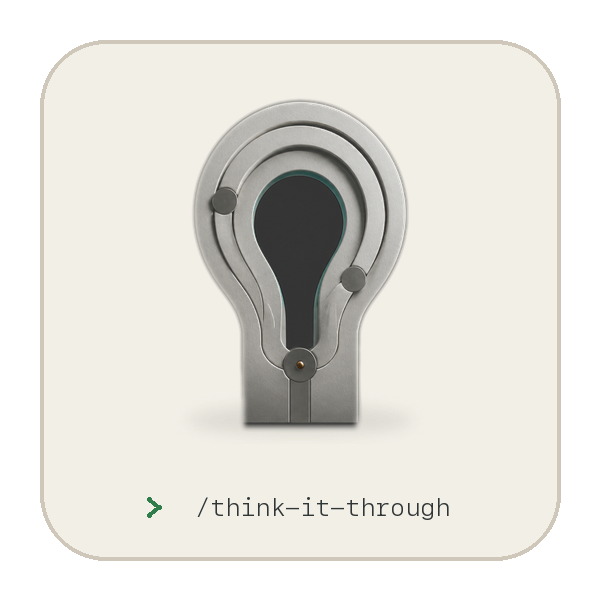

<div align="center">

<picture>
  <source media="(prefers-color-scheme: dark)" srcset="assets/readme-invocation-card-dark.png">
  <source media="(prefers-color-scheme: light)" srcset="assets/readme-invocation-card-light.png">
  
</picture>

# 想清楚 · Think It Through

**AI 能把事情做得很快，但什么值得做，仍由你决定。**

开始或继续投入前，想清楚再决定。

[](LICENSE) [](https://github.com/zemu2718/think-it-through-skill/releases/latest) [](https://github.com/zemu2718/think-it-through-skill/actions/workflows/validate.yml?query=branch%3Amain)

[什么时候调用](#什么时候调用) · [如何工作](#它怎样帮你想清楚) · [安装](#安装与使用) · [默认安全](#默认安全)

🌐 [English](README.en.md)

</div>

## 你会得到什么

- **一个明确方向：** 还没开始，判断该推进还是先验证；已经开始，判断该继续、调整、暂停还是停止。
- **一次能检验判断的小尝试：** 明确先做什么、重点观察什么，再根据实际结果判断当前方向是否还成立。
- **一份可回看的判断依据：** 记下这次要决定什么、为什么这样判断、还有哪些未知，以及什么情况会让你改变方向。

## 什么时候调用

**记住一个简单规则：** 还没开始，想清楚要不要做；已经开始，想清楚该继续、调整、暂停还是停止。

| 决策节点 | 适合讨论的问题 |
| --- | --- |
| **立项前** | 这个项目值不值得做，全面开发前最该先验证什么？ |
| **选方向前** | 哪条路更能实现真正目标，什么信息可能改变选择？ |
| **投入资源前** | 是否应该开发、招聘、采购、发布、推广、合作或作出更难撤回的承诺？ |
| **继续加码前** | 现有证据是否值得继续投入时间和预算、扩大范围或承担更多声誉风险？ |
| **结果回来后** | 根据实际发生的事，应该继续、调整、暂停还是停止？ |

如果只是查事实、执行已经决定的低风险任务、进行纯创作，或者做不涉及关键选择的代码审查或调研，就不必使用完整流程。

遇到紧急情况，先采取保护措施。医疗、法律、投资等专业事项，请咨询相应的专业人士。

## 它怎样帮你想清楚

1. **先弄清楚眼下真正要做的选择。** 从你想做的事出发，分清行动本身和真正希望达到或保护的结果；产品、功能或自研方向先作为候选解法，不直接当成已经成立的问题。
2. **找出最可能改变选择的关键信息。** 分清事实、推测、假设和未知，再只问一个可能让你换方向或改变投入程度的问题。
3. **用合适的方式确认关键答案。** 目标、底线和能承受的风险由你决定；他人的承诺向当事人确认，客户需求看真实行为，专业问题咨询专业人士。公开事实按需查证；准备重大投入时，先从真实任务和期望结果出发检查现有产品、平台能力、工具组合、流程调整等现实替代，再核验最有力的路径。
4. **根据实际结果重新判断。** 说明当前判断在什么情况下成立、出现什么情况就应该改变，再设计一个成本可控、随时可以停下的小测试；拿到结果后重新判断。最强现实替代还没有合理核验或试用时，只做有限验证，不直接进入全面建设。

### 它可能用到的方法

**它每次都会先做基础分析。** 确认眼前的选择是否真的有助于实现目标，分清事实、推测、假设和未知，并找出最可能改变判断的问题。

需要时，它还会使用两种核心方法：

- **双向钢人：** 用同一套标准认真比较当前方向和最有力的替代方案，避免只寻找支持已有想法的理由。
- **失败预演：** 先假设这条路最后失败了，再倒推可能的原因、最早会出现的信号，以及如何控制损失。

<details>
<summary><strong>查看其他七种方法</strong></summary>

- **对象校准：** 分清谁在使用、谁在付费、谁会受到影响、谁要承担后果，确认到底在为谁解决什么问题。
- **系统瓶颈：** 多个问题相互影响时，分清表面症状和真正卡住整体进展的关键问题。
- **阶段匹配：** 判断外部条件是否已经变化，以及过去有效的做法现在是否仍然适用。
- **资源支点：** 时间、资金或能力有限时，找出资源最该投在哪里，以及最多投到什么程度。
- **边界契约：** 把合作中的责任、投入、决定权、承诺和退出条件说清楚，并约定如何确认是否做到。
- **沟通匹配：** 判断清楚后，决定该对谁说、拿什么证明、通过什么渠道说，以及如何收集反馈。
- **证据闭环：** 把最初的目标和假设与实际结果进行对照，重新判断该继续、调整、暂停还是停止。

</details>

你不需要提前了解或选择这些方法。它只会推荐当前问题真正需要的思考角度，并在使用前请你确认。

如果查资料，或请其他 Agent、知情的人补充信息可能有帮助，它会先说明原因并征得你的同意。

## 安装与使用

**安装：** 把下面这句话发给你正在使用的 Agent：

```text
帮我安装这个 Skill：https://github.com/zemu2718/think-it-through-skill
```

也可以在终端直接运行：

```bash
npx skills add zemu2718/think-it-through-skill
```

无论采用哪种方式，即使安装完成，也不代表这个 Skill 已经能在当前工具中正常使用。遇到问题时，请查看[详细安装指南](docs/installation.md)和[兼容性说明](docs/compatibility-and-evidence.md)。

**开始使用：** 如果你使用 Claude Code，安装完成后输入：

```text
/think-it-through
```

接着说说你有什么想法、正面临什么选择，或者哪里还拿不准。

## 默认安全

除非你明确同意某项操作，否则它默认：

- **不联网**；
- **不读取私有数据**；
- **不调用其他 Agent**；
- **不写入文件，也不保存到远端**；
- **不替你执行外部操作**，如发送、发布、购买、删除或联系他人。

如果需要其中任何一项，它会先说明要做什么并征得你的同意。你同意一项操作，不代表也同意其他操作。

### 更多信息

- **安装与兼容：** [安装指南](docs/installation.md) · [兼容性与证据](docs/compatibility-and-evidence.md)
- **了解边界：** [产品说明](PRODUCT.md) · [正式合同](REQUIREMENTS.md) · [安全政策](SECURITY.md)
- **参与改进：** [参与贡献](CONTRIBUTING.md) · [反馈问题](https://github.com/zemu2718/think-it-through-skill/issues/new?template=install-or-runtime-feedback.yml)

如果它对你有帮助，欢迎给项目点个 Star。

本项目采用 [MIT License](LICENSE) 开源。第三方来源与改编记录见 [`THIRD_PARTY_NOTICES.md`](THIRD_PARTY_NOTICES.md) 和[第三方审计](docs/third-party-audit.md)。
