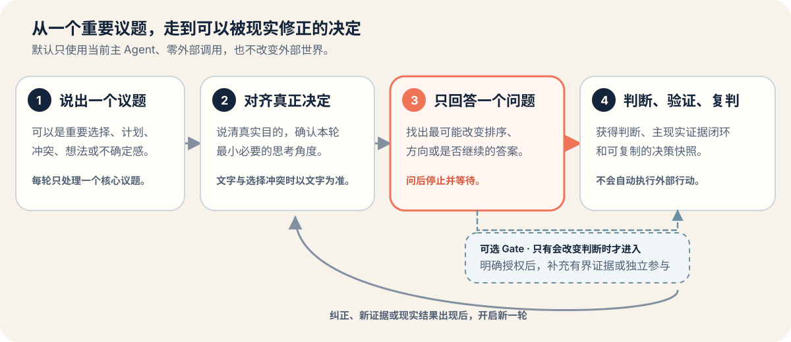

<div align="center">

[English](README.md)

<picture>
  <source media="(prefers-color-scheme: dark)" srcset="assets/hero-dark.svg">
  <source media="(prefers-color-scheme: light)" srcset="assets/hero-light.svg">
  
</picture>

# 想清楚 · Think It Through

**别让 AI 把错误的任务完成得无比漂亮。**

一个面向独立开发者、一人公司和资源有限小团队的开源 Agent Skill。项目立项、选择方向、投入更多资源之前，或现实结果回来、准备惯性继续时，都可以用它先确认真正要决定什么、找出最可能改变判断的答案，再把下一步变成可以验证、可以回头复判的行动。

[快速开始](#快速开始) · [什么时候调用](#什么时候调用) · [它如何工作](#它如何工作)

</div>

> [!IMPORTANT]
> **v0.2.0 是仓库指定的当前稳定源码快照，但目前没有公开 Git tag、GitHub Release 或可下载的 `.skill` asset。** 当前源码分支包含尚未发布的 v0.3.0 候选。下面的快速开始固定到 v0.2.0 源码提交，不依赖可能变化的分支。当前可靠入口仍是在 Claude Code 中显式调用 `/think-it-through`。

## 快速开始

### 1. 为 Claude Code 安装稳定源码快照

你需要 Git 和已安装的 Claude Code。非覆盖检查会在目标目录已存在时停止。

```bash
git clone https://github.com/zemu2718/think-it-through-skill.git
cd think-it-through-skill
git checkout 3b9320b8890d36e592e86e89bf98e5103d4cf7d1
test ! -e ~/.claude/skills/think-it-through
mkdir -p ~/.claude/skills
cp -R skills/think-it-through ~/.claude/skills/
```

如果当前 Claude Code 会话启动时还没有顶层 Skill 目录，请重启 Claude Code。

### 2. 显式调用

```text
/think-it-through
```

然后贴入一件重要选择，例如：

```text
我做了一个面向小商家的排班 SaaS，但还没有陌生客户付费。
在继续开发三个月并写投放方案前，帮我判断现在最该验证什么。
```

**第一次成功的信号：**它不会立即替你写投放方案，而会先帮你说清这次真正要做的决定。

这是源码快照，不是 GitHub Release。文件复制成功只证明文件已复制，不能证明某个 runtime/version 已加载或遵循 Skill。目标目录已经存在时不要混合两个版本；请先检查，再自行重命名或删除旧副本后重新安装。

## 30 秒说明性演示

> **说明性演示——合成示例，不是真实 runtime transcript。** 它只解释产品如何工作，不是用户评价、兼容结果或真实模型运行记录。

**表面任务**

继续开发排班产品三个月，并写一份投放方案。

**真正要决定的事**

现在应该继续投入，还是先验证陌生店主是否愿意为现有版本付费？

**一个会改变决定的答案**

哪一种真实付款或明确拒绝的结果，会让你改变继续投入的判断？

**现实证据闭环**

先展示现有版本并邀请真实付款，不新增功能；记录付款、明确拒绝和拒绝理由，再带着这些结果决定继续、调整、暂停还是停止。

这个合成示例没有擅自加入样本量、期限、价格或成功结果，也不是真实 runtime transcript。

## 什么时候调用

**记住一个简单规则：**重要投入前调用；现实结果回来后，别惯性继续，先调用。

| 决策节点 | 可以直接带来的议题 |
| --- | --- |
| **立项前** | 这个项目或产品值不值得做，全面开发前最该先验证什么？ |
| **选方向前** | 哪条路更服务真正目的，哪个未知会改变方案排序？ |
| **投入资源前** | 是否应该进入开发、招聘、采购、发布、推广、合作或更难撤回的承诺？ |
| **继续加码前** | 现有证据是否值得再投入时间、预算、范围或声誉成本？ |
| **结果回来后** | 根据实际发生的事，应该继续、调整、暂停还是停止？ |

不需要先学方法，也不用整理成正式文档。直接贴出正在考虑的选择、准备采取的动作和已经知道的约束即可；哪怕只是觉得“哪里不对”，也可以从这句话开始，Skill 会先帮你说清真正的决定。

它是决策工具，不是项目管理或任务执行层。单纯查事实、决定已经明确的低风险执行、纯创作，以及没有待决选择的代码审查或调研，应直接处理，不必套用本流程。紧急事件先采取保护动作；医疗、法律、投资等专业事项不能用它替代持证专业判断。

## 它如何工作



1. **说出正在考虑的事。** 一个问题、选择、计划，甚至只是觉得哪里不对，都可以开始。
2. **说清真正重要的结果。** 把眼前任务与真正想得到或保护的东西分开。
3. **回答一个会改变决定的问题。** 只收敛最可能改变方向、排序或投入边界的一个答案。
4. **得到判断和现实验证。** 交付一个条件化方向、一个主现实证据闭环和一份可复制的决策快照。
5. **带着结果回来复判。** 新证据可以改变判断，而不是被迫证明原判断正确。

证据或独立参与只是条件支路，也就是 Gate，不是每次必经阶段。只有它可能改变判断时才会提出，并且使用前必须取得对应授权。

## 默认安全与隐私

没有另行取得具体授权时，Skill 默认：

- **不联网**；
- **不读取私有数据**；
- **只使用当前主 Agent**；
- **不写入文件或远端保存**；
- **不执行外部行动**，包括发送、发布、购买、删除或联系他人。

只有当前会话确实提供能力、该能力对决定有明确增量，并取得对应授权时才会使用。被拒绝、失败或没有执行的动作不会写成已经完成。正式行为、安全与验收边界以 [`REQUIREMENTS.md`](REQUIREMENTS.md) 和 [`SECURITY.md`](SECURITY.md) 为准。

## 兼容性与证据状态

“符合开放格式”“安装器能复制文件”“runtime 已加载”“模型真实遵循”和“原生能力可用”是五类不同事实。

| 声明 | 当前公开状态 |
| --- | --- |
| Agent Skills 格式与仓库合同 | 当前候选源码包含静态 validator、schema、fixtures 与 harness。 |
| 安装器目标映射 | 已定义八个映射；目标映射不等于已验证 runtime。 |
| runtime 加载与纯文本行为 | 公开矩阵目前把所有 L0～L5 都记录为 `not_run`。 |
| 原生控件、搜索、额外 Agent、私有数据、持久化或外部行动 | 取决于当次会话，不能由格式或安装推定。 |

机器可读的事实源是 [`compatibility/runtime-support.json`](compatibility/runtime-support.json)。静态 CI、schema、fixtures 和线框不能证明真实模型运行或宿主原生体验。

自动发现目前也不是可靠入口：冻结 v0.1 holdout 的总结果是 **9/16——正例只有 1/8 触发，负例 8/8 保持不触发**。完整证据和限制见 [`benchmarks/trigger-v0.1/`](benchmarks/trigger-v0.1/README.md)。历史 [`v0.1 行为证据`](benchmarks/behavior-v0.1/README.md) 只有三个固定场景、每个配置一次运行，不能证明 v0.2.0 或 v0.3.0 行为。

## 常见问题

### 现在有可以下载的 Release 吗？

没有。目前不存在公开 Git tag、GitHub Release 或可下载的 `.skill` asset。快速开始安装的是仓库指定的 v0.2.0 稳定源码快照。

### 为什么 clone 后还要固定 commit？

普通 clone 会检出当时的默认分支，而默认分支以后可能移动。固定 `3b9320b8890d36e592e86e89bf98e5103d4cf7d1`，可以明确知道自己安装和审阅的具体版本。

### 怎样查看 v0.3.0 候选？

可以审阅 `feat/v0.3.0-agent-skills` 分支及其 diff。它仍是移动中的未发布源码候选，不能当作稳定下载或公开兼容证明。

### 为什么不会自动开始？

冻结的自动发现证据没有达到正例召回目标。当前使用 `/think-it-through` 显式调用，比依赖自然语言自动发现更可靠。

### 它会自动搜索、读文件或调用多个 Agent 吗？

不会。这些能力默认关闭，而且彼此独立；只有必要性、当前会话能力和对应授权都成立时才会使用。

### 怎样做项目级安装、更新或构建本地候选包？

项目级安装时，把 `skills/think-it-through` 复制到目标项目的 `.claude/skills/`，同样保留非覆盖检查。更新或卸载前先检查实际安装目录，不要混合版本。维护者校验和本地候选包构建命令见 [`CONTRIBUTING.md`](CONTRIBUTING.md)。

## 文档导航

| 你想了解 | 去这里 |
| --- | --- |
| 产品目的、目标用户和非目标 | [`PRODUCT.md`](PRODUCT.md) |
| 唯一正式行为、安全与验收合同 | [`REQUIREMENTS.md`](REQUIREMENTS.md) |
| 运行时维护源 | [`skills/think-it-through/SKILL.md`](skills/think-it-through/SKILL.md) |
| `.skill` 精确文件集合 | [`distribution/package-manifest.json`](distribution/package-manifest.json) |
| runtime 兼容证据状态 | [`compatibility/runtime-support.json`](compatibility/runtime-support.json) |
| 非规范性架构理由 | [`docs/product-architecture-v0.3.0.md`](docs/product-architecture-v0.3.0.md) |
| 参与贡献 | [`CONTRIBUTING.md`](CONTRIBUTING.md) |
| 私下报告安全问题 | [`SECURITY.md`](SECURITY.md) |
| 源码版本历史 | [`CHANGELOG.md`](CHANGELOG.md) |

## 参与贡献

最有价值的是具体、可测试的贡献：

- 能暴露问题的真实决策用例；
- 应触发或不应触发的近邻样本；
- 可复现的安装或兼容观察；
- 可访问性、隐私、安全或来源追溯修正。

请从 [`CONTRIBUTING.md`](CONTRIBUTING.md) 开始；安全问题请按 [`SECURITY.md`](SECURITY.md) 私下报告。

如果你实际用过后觉得有帮助，欢迎 Star，方便以后再次找到。具体用例和问题反馈同样重要。

## 许可证

想清楚使用 [MIT License](LICENSE)。第三方方法的来源、固定 revision、许可证和实质修改记录在 [`THIRD_PARTY_NOTICES.md`](THIRD_PARTY_NOTICES.md) 与[第三方审计](docs/third-party-audit.md)中。
