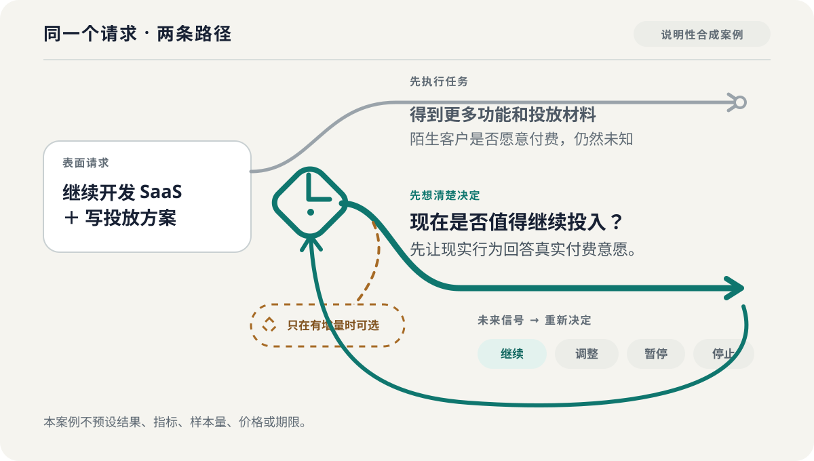

<div align="center">

[English](README.md)

<picture>
  <source media="(prefers-color-scheme: dark)" srcset="assets/readme-banner-dark.png">
  <source media="(prefers-color-scheme: light)" srcset="assets/readme-banner-light.png">
  
</picture>

# 想清楚 · Think It Through

**AI 能把事情做得很快，但不能替你决定什么值得做。**

重要投入之前，先确认真正要决定什么、哪个未知会改变方向；结果回来之后，再决定继续、调整、暂停还是停止。

[](https://github.com/zemu2718/think-it-through-skill/actions/workflows/validate.yml?query=branch%3Amain)
[](skills/think-it-through/SKILL.md)
[](https://github.com/zemu2718/think-it-through-skill/tree/v0.3.0/skills/think-it-through)
[](LICENSE)

**当前可靠入口：** 在 Claude Code 中显式调用 `/think-it-through`。

Validate 徽章只反映远端已提交 `main` 的 workflow 状态，不代表本地未提交工作区。

</div>

## 这是什么

“想清楚”是一个用于重要行动前后决策的开源 Agent Skill。它把表面请求还原成背后的真正决定，找出最可能改变判断的一个答案，再把下一步变成现实可以检验的行动。

它是决策层，不是项目管理或任务执行层。它帮助你判断要不要做、选哪条路、投入到什么边界，以及新结果出现后应该继续、调整、暂停还是停止。

## 为什么需要它

AI 已经可以很快产出方案、代码、投放文案、调研和漂亮的交付物，即使真正的选择还没有说清。于是，错误方向也会更快、更有说服力、更昂贵地推进。

“想清楚”会在承诺资源前留出一个看清决定的开口：把眼前动作、真正想得到或保护的结果、约束和未知同时放在视野里，直到真正的选择浮现，再把仅靠推理无法回答的问题交给现实。

## 一个具体案例

> **说明性合成案例——不是真实 runtime transcript、用户故事、评价、兼容结果或真实模型运行。**

<picture>
  <source media="(prefers-color-scheme: dark)" srcset="assets/decision-case-dark.zh-CN.svg">
  <source media="(prefers-color-scheme: light)" srcset="assets/decision-case-light.zh-CN.svg">
  
</picture>

你让 AI **继续开发 SaaS 并写投放方案**。如果先执行任务，确实可以得到更多功能和投放材料，却可能完全没有碰到最决定方向的未知：陌生客户是否会表现出真实付费意愿？

“想清楚”会先把请求改写成**现在是否值得继续投入**。它不把产出数量当作进展，而是让下一次投入优先服务于一个现实行为，使这个判断得到支持或反对。

信号回来后，决定重新打开：继续、调整、暂停或停止。这个案例刻意没有预设结果、成功指标、样本量、价格或期限；图和文字只说明产品关系，不能证明任何 runtime 已经真实这样工作。

## 什么时候调用

**记住一个简单规则：** 重要投入前调用；现实结果回来后，别惯性继续，先调用。

| 决策节点 | 可以直接带来的议题 |
| --- | --- |
| **立项前** | 这个项目值不值得做，全面开发前最该先验证什么？ |
| **选方向前** | 哪条路更服务真正目的，哪个未知会改变方案排序？ |
| **投入资源前** | 是否应该开发、招聘、采购、发布、推广、合作或作出更难撤回的承诺？ |
| **继续加码前** | 现有证据是否值得再投入时间、预算、范围或声誉成本？ |
| **结果回来后** | 根据实际发生的事，应该继续、调整、暂停还是停止？ |

不用先学方法，也不用整理正式文档。直接贴出正在考虑的选择、准备采取的动作和已知约束即可；哪怕只是觉得“哪里不对”，也可以从这句话开始。

单纯查事实、决定已明确的低风险执行、纯创作，以及没有待决用户选择的代码审查或调研，不需要进入完整流程。紧急事件先采取保护动作；医疗、法律、投资等专业事项不能用它替代持证专业判断。

## 安装并完成第一次体验

> [!IMPORTANT]
> **v0.3.0 是当前稳定源码和正式产品合同，已发布为不可变 Git tag、GitHub Release 与可下载的 `.skill` asset。** 安装成功只说明文件已经进入目标目录；runtime 是否真实加载、模型是否遵循、原生能力是否可用，仍是彼此独立的版本化事实。

### 使用 GitHub CLI 安装

安装 [GitHub CLI 2.98.0 或更高版本](https://cli.github.com/)后，可以把固定版本安装到受支持的编程 Agent。下面以 Claude Code 和用户级安装为例：

```bash
gh skill install \
  zemu2718/think-it-through-skill \
  think-it-through@v0.3.0 \
  --agent claude-code \
  --scope user
```

可以把 `--agent` 换成当前 GitHub CLI 识别的其他目标。保留 `@v0.3.0`，就能固定安装来源，而不是跟随移动分支。

### 从 Release asset 安装到不同客户端

发布的 `.skill` 是 ZIP 兼容归档，只包含 manifest 声明的运行时文件。固定版本的 `skills` CLI 可以先交互选择安装目标：

```bash
npx -y skills@1.5.23 add \
  https://github.com/zemu2718/think-it-through-skill/releases/download/v0.3.0/think-it-through.skill
```

如果要把复制式、用户级安装写入该安装器版本认识的全部目标：

```bash
npx -y skills@1.5.23 add \
  https://github.com/zemu2718/think-it-through-skill/releases/download/v0.3.0/think-it-through.skill \
  --agent '*' \
  --global \
  --copy \
  --yes
```

`--agent '*'` 只表示 `skills@1.5.23` 认识的全部目标映射；不表示所有 AI 客户端都在其中，也不表示这些客户端已经通过真实 runtime 验证。需要交互选择时省略该参数；只装一个目标时，把 `'*'` 换成准确 target。

安装前可以使用 Release 同时发布的 [`SHA256SUMS`](https://github.com/zemu2718/think-it-through-skill/releases/download/v0.3.0/SHA256SUMS) 核对下载归档。

### 从不可变 tag 手动安装

如果两个安装器都不支持你的宿主，请按该宿主的 Agent Skills 目录约定复制 Skill。Claude Code 的手动兜底命令如下：

```bash
git clone --depth 1 --branch v0.3.0 https://github.com/zemu2718/think-it-through-skill.git
cd think-it-through-skill
git rev-parse HEAD
test ! -e ~/.claude/skills/think-it-through
mkdir -p ~/.claude/skills
cp -R skills/think-it-through ~/.claude/skills/
```

非覆盖检查会在旧副本已存在时停止。不要混合两个版本；请先检查，再自行重命名或删除旧副本后重新安装。

如果当前 Claude Code 会话启动时还没有顶层 Skill 目录，请重启 Claude Code。然后显式调用：

```text
/think-it-through
```

可以先粘贴这个合成输入，也可以直接换成自己的真实选择：

```text
我做了一个面向小商家的排班 SaaS，但还没有陌生客户付费。
在继续开发三个月并写投放方案前，帮我判断现在最该验证什么。
```

**第一次成功的信号：** 它不会立即替你写投放方案，而会先帮你说清这次真正要做的决定。仅仅安装或调用，并不会自动授权联网、读取私有数据、增加 Agent、保存文件或执行外部行动。

三条安装路径分发的是同一份 v0.3.0 运行时源码。文件复制成功只证明文件已复制，不能证明某个 runtime/version 已加载或遵循 Skill。

## 一次完整检查会发生什么

1. **把动作和目的分开。** 说清眼前任务究竟要带来或保护什么结果。
2. **只确认有增量的思考角度。** 基础分析始终存在；额外方法只有在提供独特价值且经你确认时才加入。
3. **只回答一个决定性问题。** 聚焦最可能改变方向、排序或投入边界的一个答案。
4. **只有真正需要时才升级。** 证据或独立参与是在你回答后的条件支路，范围有界、另行授权，不是固定流水线。
5. **得到一个综合结果。** 交付一个条件化判断、一个主现实证据闭环和一份可复制的决策快照，并把事实、推断、假设、未知和反转信号分开保留。
6. **让现实回来复判。** 新结果可以修正判断，而不是被迫证明原判断正确。

方法、调研、额外 Agent 和真人输入都服务于这一个结果，不会变成彼此分离的报告堆或多数票。

## 默认安全与隐私

没有另行取得具体授权时，Skill 默认：

- **不联网**；
- **不读取私有数据**；
- **只使用当前主 Agent**；
- **不写入文件或远端保存**；
- **不执行外部行动**，包括发送、发布、购买、删除或联系他人。

能力调用、参与委派、私有数据访问和外部行动是四类彼此独立的授权。确认方法、选择上下文检查点、设置 Agent 上限或提供反馈，都不会自动授权其中任何一类。被拒绝、失败或没有执行的动作不会写成已经完成。

正式行为、安全与验收边界以 [`REQUIREMENTS.md`](REQUIREMENTS.md) 和 [`SECURITY.md`](SECURITY.md) 为准。

## 版本、兼容性与证据

**稳定发布：** [`v0.3.0`](https://github.com/zemu2718/think-it-through-skill/releases/tag/v0.3.0)，由不可变 Git tag、GitHub Release、可下载的 [`think-it-through.skill`](https://github.com/zemu2718/think-it-through-skill/releases/download/v0.3.0/think-it-through.skill) 与 [`SHA256SUMS`](https://github.com/zemu2718/think-it-through-skill/releases/download/v0.3.0/SHA256SUMS) 共同建立；后续开发继续位于持续维护的 [`main`](https://github.com/zemu2718/think-it-through-skill/tree/main/skills/think-it-through)。发布状态表示产品合同和确定性准入链已经确立，不代表所有客户端均已认证，也不会把未运行的兼容层级自动改为通过。

<details>
<summary>兼容层级与当前公开状态</summary>

“符合开放格式”“安装器能发现”“完成精确安装”“runtime 真实加载”“模型真实遵循”和“原生能力可用”是不同事实。

| 层级 | 含义 | 当前公开状态 |
| --- | --- | --- |
| L0 | 格式校验 | 公开 runtime 矩阵为 `not_run` |
| L1 | 安装器发现 | `not_run` |
| L2 | 精确安装 | `not_run` |
| L3 | 真实 runtime 加载 | `not_run` |
| L4 | 真实纯文本行为 | `not_run` |
| L5 | 真实原生能力 | `not_run` |

v0.3.0 为能够加载 Agent Skills 目录并遵循文本指令的宿主提供可移植纯文本基线。仓库维护 Claude Code、Codex、Cursor、Gemini CLI、Hermes Agent、OpenClaw、OpenCode 与 CodeBuddy / WorkBuddy 八个安装器目标映射；未列出的兼容宿主也可以按自身 Skill 目录约定使用同一文本合同。映射或可移植合同不等于已验证 runtime，机器可读证据事实源是 [`compatibility/runtime-support.json`](compatibility/runtime-support.json)。静态 CI、schema、fixtures、评分器和图示可以证明合同已经定义，不能证明真实模型运行、自然语言自动发现或宿主原生体验。

</details>

<details>
<summary>自动发现与上下文检查点的限制</summary>

自动发现目前不是可靠入口：冻结 v0.1 holdout 的总结果是 **9/16——正例只有 1/8 触发，负例 8/8 保持不触发**。完整证据与限制见 [`benchmarks/trigger-v0.1/`](benchmarks/trigger-v0.1/README.md)。历史 [`v0.1 行为证据`](benchmarks/behavior-v0.1/README.md) 只有三个固定场景、每个配置一次运行，不能证明 v0.2.0 或 v0.3.0 行为。

v0.3.0 正式合同只在 Skill 已经加载、当前没有正式流程，并且对话跨入立项、选方向、重大投入、继续加码或结果复判时，定义一个轻量上下文检查点。真实多轮状态仍为 `not_run`；合同不能证明自然语言自动发现、自动加载或对话中途可靠唤起。当前可靠入口仍是显式 `/think-it-through`。

</details>

## 文档与参与

| 你想了解 | 去这里 |
| --- | --- |
| 产品目的、目标用户和非目标 | [`PRODUCT.md`](PRODUCT.md) |
| 唯一正式行为、安全与验收合同 | [`REQUIREMENTS.md`](REQUIREMENTS.md) |
| 运行时维护源 | [`skills/think-it-through/SKILL.md`](skills/think-it-through/SKILL.md) |
| `.skill` 精确文件集合 | [`distribution/package-manifest.json`](distribution/package-manifest.json) |
| runtime 兼容证据状态 | [`compatibility/runtime-support.json`](compatibility/runtime-support.json) |
| 反馈安装或 runtime 观察 | [打开反馈表单](https://github.com/zemu2718/think-it-through-skill/issues/new?template=install-or-runtime-feedback.yml) |
| 参与具体用例或修复 | [`CONTRIBUTING.md`](CONTRIBUTING.md) |
| 私下报告安全问题 | [`SECURITY.md`](SECURITY.md) |
| 源码版本历史 | [`CHANGELOG.md`](CHANGELOG.md) |

最有价值的是具体、可测试的贡献：能暴露问题的真实决策用例、应触发或不应触发的近邻样本、可复现的安装观察，以及可访问性、隐私、安全或来源追溯修正。反馈安装或 runtime 问题时，请附 `git rev-parse HEAD`、准确 runtime 版本、操作系统、安装方式、复现步骤、预期结果与实际结果。报告先作为复现和优化线索；只有绑定版本、完成脱敏与审阅并形成 approved evidence 后，才会改变兼容矩阵。

如果你实际用过后觉得有帮助，欢迎 Star，方便以后再次找到。具体用例和问题反馈同样重要。

## 许可证

想清楚使用 [MIT License](LICENSE)。第三方方法的来源、固定 revision、许可证和实质修改记录在 [`THIRD_PARTY_NOTICES.md`](THIRD_PARTY_NOTICES.md) 与[第三方审计](docs/third-party-audit.md)中。
