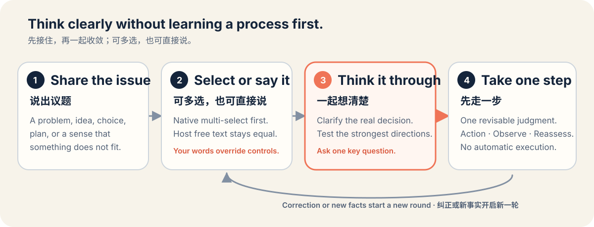

<div align="center">
  

# 想清楚 · Think It Through

**别让 AI 把错误的任务完成得无比漂亮。**

一个开源 Agent Skill：识别表面动作背后的真实目的，找出最可能改变决定的一个答案，并把它转为一个可验证、有边界、尽量可撤回的下一步。

[English](README.md) · [产品文档](PRODUCT.md) · [需求与验收](REQUIREMENTS.md) · [参与贡献](CONTRIBUTING.md)

</div>

> [!IMPORTANT]
> 核心 Skill、行为评测、生成式 PNG 资产、包内容检查、解包后的 quick validation、官方 `skills-ref` 校验和隔离环境中的 Claude Code 源码安装均已完成。自动发现没有通过冻结 holdout（正例召回 1/8，负例规避 8/8），客户端内 `.skill` 压缩包端到端安装也未验证。v0.1 请显式使用 `/think-it-through`，不要把自然语言自动加载或其他客户端兼容性表述为已成立。

## 它解决什么问题

AI 很擅长完成明确任务。但如果用户提出的动作并不服务真实目的，这种能力反而会放大浪费：

- 还没人证明愿意付费，就先写完整投放方案；
- 因为已经投入很多，所以继续投入；
- 合作边界尚未明确，就先优化说服话术；
- 真正只差一个会改变排序的答案，却继续生成更多选项。

想清楚会在重要动作前插入一个刻意的检查点：

```text
表面任务 → 真实目的 → 决策问题
```

它不替你拍板，而是帮助你看见自己真正选择的是什么、什么证据能推翻当前判断，以及怎样在不过度承诺的情况下获得答案。

## 安装前先看交互



| 阶段 | Skill 做什么 | 等待边界 |
| --- | --- | --- |
| **R — 推荐** | 重构表面任务、暂定真实目的和决策问题，推荐最小充分分析。 | 等你明确确认或调整方法。 |
| **A — 分析** | 执行基础分析和你确认的方法，找出决策敏感度最高的变量。 | 以一个且只有一个独立问题结束。 |
| **B — 判断** | 吸收你的回答，包括“不知道”，给出一个条件化判断和一个有边界的下一步。 | 本轮结束，不替你自动执行。 |

[`SaaS 付费验证`](skills/think-it-through/examples/saas-validation.md)和[`合作边界`](skills/think-it-through/examples/partnership-boundary.md)是固定行为评测中的 `with_skill` 逐字输出，不是重新润色的成功故事。

<details>
<summary><strong>真实短演示：从“写投放方案”到付费验证</strong></summary>

**用户：**我做了一个面向小商家的排班 SaaS，还没有陌生客户付费。本来想写投放方案并继续开发三个月。现在该这样做吗？

**R：**Skill 暂定把决定重构为“继续开发和投放，还是先检验现有版本是否值得陌生商家付费”，推荐三个方法，给出四类入口，然后等待。

**用户：**按推荐继续。

**A：**它比较最强竞争判断、追踪失败机制，并以一个问题结束：十家匹配的陌生商家中，至少几家按真实可接受价格付费，才足以继续投入三个月？

**用户：**少于两家，我就不会继续开发。

**B — 小步验证：**七天内，只把未新增功能的现有版本按一个真实价格提供给十家匹配的陌生商家。第七天复判：至少两家付款则有条件推进，少于两家则停止三个月开发承诺。

[查看逐字 transcript 和正式评分 →](benchmarks/behavior-v0.1/eval-1-saas-misalignment/with_skill/transcript.md)

</details>

## 它有什么不同

### “一个问题”只有一个答案槽

阶段 A 的问题不能是伪装成一句的问卷。“预算、期限和最低回报分别是多少”虽然只有一个问号，却需要三个独立答案，因此不合格。

Skill 真正寻找的是：

> 哪一个答案一旦不同，最可能改变方案排序、行动方向或是否继续？

### 方法必须由你确认

基础分析始终存在。可选方法只有在产生独立价值时才会被推荐：

- **双向钢人**：用接近的证据标准检验两个最强竞争判断；
- **失败预演**：从一个具体未来失败，追踪 1～3 条因果链和早期信号；
- **中性专项方法卡**：校准服务对象、系统瓶颈、阶段匹配、资源支点、合作边界、沟通匹配，或用已发生结果复判。

你可以按推荐继续、调整方法、只做基础分析，或补充背景。补充背景绝不会被偷偷视为方法确认。

### 最终产物是判断，不是框架大全

回答关键问题后，Skill 只使用一个正式状态：

| 尚未执行 | 已经执行 |
| --- | --- |
| 暂不行动 / 小步验证 / 有条件推进 / 可以推进 | 继续 / 调整 / 暂停 / 停止 |

下一步只有一个主动作，可以包含时间或成本上限、成功信号、停止或转向条件和复判节点，但不会变成新的待办列表。

## 什么时候应该触发

可以显式使用 `/think-it-through`，也可以自然描述议题。适合那些不确定、代价高、难撤回，或已经持续消耗资源的重要选择：

- “这件事值不值得做？”
- “我在 A 和 B 之间纠结。”
- “投入六个月之前先帮我检验这个想法。”
- “我让 AI 执行的动作真的服务目标吗？”
- “应该继续、调整、暂停还是停止？”
- “找出最可能改变这个决定的问题。”
- “我想找一个会做取舍分析、正反钢人、失败预演和可撤回下一步的决策 Skill。”
- “还没想清楚 / 下一步最该做什么 / 这个计划是不是走偏了。”

这些表达也适合作为 Skill 目录的搜索词：**决策支持**、**决策框定**、**取舍分析**、**失败预演**、**双向钢人**、**可撤回下一步**、**继续调整暂停停止**。在仓库公开后被外部索引真实收录之前，本项目不会宣称能通过某个特定外部查询找到。

它面向产品与商业、职业、团队、合作、关系边界、高成本选择，以及已经执行事项的复判。

### 什么时候不应该触发

以下情况应该保持克制：

- 事实查询或决策方法定义；
- 决定已经做出、规格清楚、低风险且可撤回的执行任务；
- 纯创作或娱乐；
- 不包含用户待决选择的代码审查、FMEA、调研或项目排期；
- 紧急安全事件——此时优先给明确保护指引。

边界和召回同样重要。如果只要出现“trade-off”“暂停”或“失败预演”就触发，它就不是一个有用的决策 Skill。

## 安装

下方已经核对的源码目录方式遵循 Claude Code 官方文档中的个人和项目 Skill 路径。目录名会成为显式命令，`description` 用于匹配自然语言并自动加载。

### 个人安装——所有本地项目可用

```bash
git clone https://github.com/zemu2718/think-it-through-skill.git
test ! -e ~/.claude/skills/think-it-through
mkdir -p ~/.claude/skills
cp -R think-it-through-skill/skills/think-it-through ~/.claude/skills/
```

### 项目安装——只在一个仓库可用

克隆本仓库后，在目标项目根目录执行：

```bash
test ! -e .claude/skills/think-it-through
mkdir -p .claude/skills
cp -R /path/to/think-it-through-skill/skills/think-it-through .claude/skills/
```

如果已经安装过 `think-it-through`，请先自行删除或改名现有目录，不要直接把两个版本合并。Claude Code 会实时检测已经存在的 Skill 目录内的修改。如果启动会话时顶层 `~/.claude/skills/` 或 `.claude/skills/` 尚不存在，创建后请重启 Claude Code。

显式调用：

```text
/think-it-through
```

也可以自然提问，例如：“我准备为这个想法投入六个月，先帮我检验这个动作是否服务真实目的。”

Skill 本身不需要网络、API Key、账号、可执行脚本或远程依赖。目前只确认了它作为源码 Skill 在**本地 Claude Code 2.1.245** 中的行为：在隔离项目里按官方目录放置副本后，显式 `/think-it-through` 和匹配的自然语言请求都加载了 Skill，并按合同停在阶段 R。`.skill` 分发包已经构建、检查、解包并通过 quick validation，但尚不宣称压缩包端到端安装或其他客户端已经兼容。

Claude Code 官方参考：[Extend Claude with skills](https://code.claude.com/docs/en/slash-commands)。

## 评测

仓库把两个不同的问题分开验证：

1. **发现性**：description 是否能在重要决策支持请求上触发，并避开近邻负例？
2. **加载后的行为**：与无 Skill 基线相比，是否更好地遵守多轮 R → A → B 合同？

### 当前行为快照

3 个固定三轮场景分别用 Skill 和严格独立的无 Skill 基线各运行 1 次。

| 指标 | With Skill | Without Skill | 差值 |
| --- | ---: | ---: | ---: |
| 合同断言通过率 | **100.0%** | 57.4% | +0.43 |
| 20 分语义 rubric | **98.3%** | 38.3% | +0.60 |
| 通过完整语义门槛的运行 | **3/3** | 0/3 | — |

完整语义门槛要求：没有严重失败，总分至少 18/20，而且问题质量、阶段 B 判断、用户控制与安全均为 2 分。逐字 transcript、每条断言证据、rubric 证据、SHA-256 绑定和聚合 JSON 都在 [`benchmarks/behavior-v0.1/`](benchmarks/behavior-v0.1/) 中。

> [!CAUTION]
> 这是合同回归快照，不是总体回答质量排名，也不证明统计显著性。每个场景和配置只有一次运行；运行时报告的模型名没有通过独立 API metadata 核验；无法获得可比的 token 和耗时，因此未展示。无 Skill 基线也常能给出有用建议；这里测量的是 R → A → B 产品合同和对应 rubric。

行为夹具还覆盖：只补背景但未确认、取消方法、“不知道”、已执行事项、反操控、事实和低风险绕过、紧急事件、外部能力降级、三类授权分离，以及七张专项卡的路由边界。

确定性仓库检查使用 Python 3.12 和 PyYAML：

```bash
uv run --python 3.12 --with pyyaml python -m unittest discover -s scripts -p 'test_*.py' -v
uv run --python 3.12 --with pyyaml python scripts/validate_repo.py
```

自动发现先在 16 条 dev 上运行 1 次，七个 dev 失败用于进行一次 description 修订。由于再次运行 dev 会超过本会话累计 50 个代理上限，因此没有复测。修订后的 description 在未查看 holdout 前冻结，SHA-256 为 `f89f3d1f…e4c6f3d3`。最终 16 条 holdout **通过 9/16**：8 个负例全部未触发，但 8 个正例仅触发 1 个，因此没有达到发现性门槛；holdout 结果也没有回流到 v0.1 调优。逐条结果和限制见 [`benchmarks/trigger-v0.1/`](benchmarks/trigger-v0.1/)。

## 安全、隐私与用户控制

想清楚是纯指令型 Skill，默认不需要联网，也不会读取私有数据。

它把三类权限彼此分离：

1. 调用能力或工具；
2. 访问私有数据；
3. 发送、发布、购买、删除或修改等外部行动。

任何一种授权都不继承另一种。确认分析方法不是工具授权；允许浏览不等于允许读取私有文件或联系他人；分析前提出的执行要求不会在判断后自动复用为行动授权。

Skill：

- 不替代医疗、法律、投资或紧急专业帮助；
- 不提供操控、欺骗、恐吓、跟踪或胁迫策略；
- 区分已确认事实、合理推断、待验证假设和关键未知；
- 把最终选择和任何外部行动留给你。

详见 [`SECURITY.md`](SECURITY.md) 和 [`safety-boundaries.md`](skills/think-it-through/references/safety-boundaries.md)。

## 透明的方法来源

七张专项方法卡中性改编自 `SamadhiFire/xinqingnian-maoxuan-skill` 一个固定版本中的 MIT 文件。人物模仿、政治和军事框架、胁迫策略与未经支持的权威断言均被移除。另外三个候选仓库经过审计后未被采用。

每张采用卡都记录仓库、固定 commit、准确文件、许可证和实质修改。详见 [`docs/third-party-audit.md`](docs/third-party-audit.md) 和 [`THIRD_PARTY_NOTICES.md`](THIRD_PARTY_NOTICES.md)。

## 项目结构

```text
skills/think-it-through/
├── SKILL.md                    # 核心状态合同
├── references/                 # 分析、方法、安全与授权
├── examples/                   # 通过评测的逐字多轮 transcript
├── evals/                      # 行为、触发与路由定义
├── LICENSE
└── THIRD_PARTY_NOTICES.md

benchmarks/behavior-v0.1/       # 公开 transcript 与行为证据
benchmarks/trigger-v0.1/        # 自动发现结果，包括未通过的 holdout
scripts/                        # 确定性评分和校验
assets/                         # 原创项目视觉
```

临时评测 workspace、本地 viewer、缓存和打包产物不会加入源码版本控制。

## 参与贡献

最有价值的贡献包括真实决策用例、近邻触发负例、更简洁的指令、方法路由测试、可访问性提升和可复现的校验修复。新框架或人物必须证明独立决策价值，而不是只让功能清单变长。

请从 [`CONTRIBUTING.md`](CONTRIBUTING.md) 开始；安全问题按 [`SECURITY.md`](SECURITY.md) 私下报告。

## 许可证

想清楚使用 [MIT License](LICENSE) 开源。第三方归属保留在 [`THIRD_PARTY_NOTICES.md`](THIRD_PARTY_NOTICES.md) 中。
